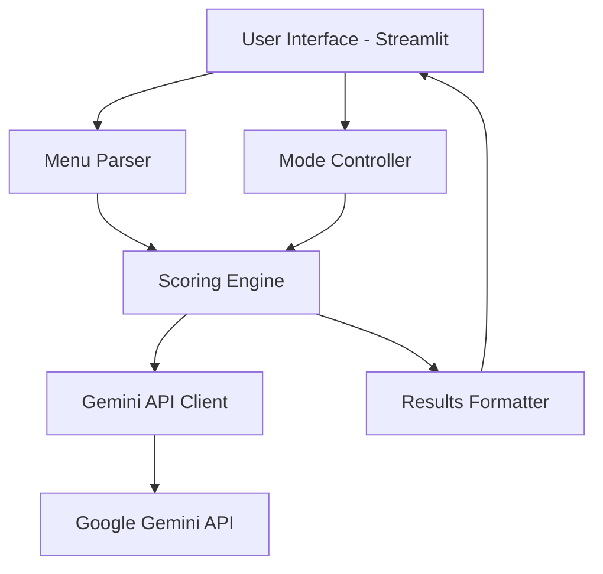

# Design Document: AI Menu Referee

## Overview

BiteBalance is a Streamlit-based web application that serves as an AI-powered "referee" between health goals and flavor cravings. The system uses dynamic agent steering to adjust recommendation priorities based on user-selected modes (Zen for health-focused, Gremlin for taste-focused). The application integrates with Google's Gemini API to analyze menu items and provide personalized recommendations with clear scoring and reasoning.

## Architecture

The system follows a three-tier architecture:

1. **Presentation Layer**: Streamlit web interface with responsive UI components
2. **Business Logic Layer**: Menu parsing, scoring engine, and recommendation logic
3. **External Services Layer**: Google Gemini API integration for AI-powered analysis



## Components and Interfaces

### 1. User Interface Components

**ModeSelector**
- Implements sliding toggle using `st.radio()` with horizontal layout
- Manages state persistence using `st.session_state`
- Updates context indicators dynamically

**MenuInput**
- Text area component using `st.text_area()` for menu dump input
- Validation for non-empty input
- Placeholder text guidance

**ResultsDisplay**
- Winner card with highlighted styling using `st.success()` or custom CSS
- Progress bars for health/taste scores using `st.progress()`
- Expandable sections for detailed reasoning

### 2. Core Business Logic

**MenuParser**
```python
class MenuParser:
    def parse_menu_text(self, raw_text: str) -> List[MenuItem]
    def extract_items(self, text: str) -> List[str]
    def clean_item_name(self, item: str) -> str
```

**ScoringEngine**
```python
class ScoringEngine:
    def calculate_scores(self, items: List[MenuItem], mode: SteringMode) -> List[ScoredItem]
    def apply_mode_weights(self, health_score: float, taste_score: float, mode: SteringMode) -> float
```

**GeminiClient**
```python
class GeminiClient:
    def analyze_menu_items(self, items: List[str], mode: SteringMode) -> AnalysisResult
    def format_prompt(self, items: List[str], mode: SteringMode) -> str
```

### 3. Data Models

**MenuItem**
```python
@dataclass
class MenuItem:
    name: str
    description: Optional[str] = None
    price: Optional[str] = None
    category: Optional[str] = None
```

**ScoredItem**
```python
@dataclass
class ScoredItem:
    item: MenuItem
    health_score: float  # 1-10
    taste_score: float   # 1-10
    final_score: float   # Weighted combination
    reasoning: str
```

**SteringMode**
```python
class SteringMode(Enum):
    ZEN = "zen"      # Health-focused: 0.8 health + 0.2 taste
    GREMLIN = "gremlin"  # Taste-focused: 0.1 health + 0.9 taste
```

**AnalysisResult**
```python
@dataclass
class AnalysisResult:
    winner: ScoredItem
    all_items: List[ScoredItem]
    rejected_items: List[str]
    modification_tip: str
```

## Correctness Properties

*A property is a characteristic or behavior that should hold true across all valid executions of a system-essentially, a formal statement about what the system should do. Properties serve as the bridge between human-readable specifications and machine-verifiable correctness guarantees.*

### Property 1: Mode Selection State Consistency
*For any* valid steering mode selection, the system should update the context indicator text to match the selected mode
**Validates: Requirements 1.4**

### Property 2: Session State Persistence
*For any* mode selection during a session, the selected mode should remain active across all operations until explicitly changed
**Validates: Requirements 1.5**

### Property 3: Menu Parsing Completeness
*For any* valid menu text input, the parser should extract at least one menu item with a non-empty name
**Validates: Requirements 2.2, 7.1**

### Property 4: UI Feedback Responsiveness
*For any* user interaction (button clicks, mode changes), the system should provide immediate visual feedback
**Validates: Requirements 2.3, 5.5**

### Property 5: Error Handling Consistency
*For any* invalid input or parsing failure, the system should display a user-friendly error message without crashing
**Validates: Requirements 2.5, 7.4**

### Property 6: Score Range Validation
*For any* menu item processed by the Referee, both Health_Score and Taste_Score should be within the range 1-10 inclusive
**Validates: Requirements 3.1**

### Property 7: Zen Mode Scoring Formula
*For any* menu item in Zen Mode, the Final_Score should equal (Health_Score × 0.8) + (Taste_Score × 0.2)
**Validates: Requirements 3.2**

### Property 8: Gremlin Mode Scoring Formula
*For any* menu item in Gremlin Mode, the Final_Score should equal (Health_Score × 0.1) + (Taste_Score × 0.9)
**Validates: Requirements 3.3**

### Property 9: Winner Selection Correctness
*For any* set of scored menu items, the selected winner should have the highest Final_Score among all items
**Validates: Requirements 3.4**

### Property 10: Explanation Content Requirements
*For any* generated explanation, it should mention at least one rejected menu item by name
**Validates: Requirements 4.4**

### Property 11: Prompt Mode Injection
*For any* API call to the Gemini service, the current steering mode should be included in the prompt text
**Validates: Requirements 6.1**

### Property 12: Zen Mode AI Behavior
*For any* menu analysis in Zen Mode, items with higher protein content and lower calories should receive higher health scores
**Validates: Requirements 6.2**

### Property 13: Gremlin Mode AI Behavior
*For any* menu analysis in Gremlin Mode, items with rich descriptions (sauces, signature dishes) should receive higher taste scores
**Validates: Requirements 6.3**

### Property 14: Structured Output Format
*For any* successful API response, the output should contain all required fields: Winner, Health_Score, Taste_Score, Verdict, and Modification
**Validates: Requirements 6.4**

### Property 15: API Error Resilience
*For any* API failure or timeout, the system should handle the error gracefully and display an appropriate message to the user
**Validates: Requirements 6.5**

### Property 16: Menu Format Robustness
*For any* common menu format (with prices, descriptions, categories), the parser should successfully extract dish names
**Validates: Requirements 7.2, 7.3**

### Property 17: Context Preservation
*For any* parsed menu item, if the original text contained descriptions or context, that information should be preserved for scoring
**Validates: Requirements 7.5**

## Error Handling

The system implements comprehensive error handling across all layers:

### Input Validation
- Empty menu input validation with user-friendly prompts
- Mode selection validation to ensure valid enum values
- Text parsing validation to handle malformed menu data

### API Integration
- Gemini API timeout handling (30-second timeout)
- Rate limiting and quota management
- Fallback responses when API is unavailable
- Structured error responses with actionable user guidance

### Data Processing
- Menu parsing error recovery with partial results
- Score calculation validation to ensure numeric ranges
- Graceful degradation when some menu items cannot be processed

### User Experience
- Non-blocking error messages that don't interrupt workflow
- Clear error descriptions with suggested remediation steps
- Automatic retry mechanisms for transient failures

## Testing Strategy

The testing approach combines unit testing for specific functionality with property-based testing for universal correctness guarantees.

### Unit Testing Framework
- **Framework**: pytest for Python testing
- **Coverage**: Minimum 80% code coverage for core business logic
- **Focus Areas**:
  - Menu parsing edge cases (empty input, malformed text)
  - UI component rendering and state management
  - API integration error s